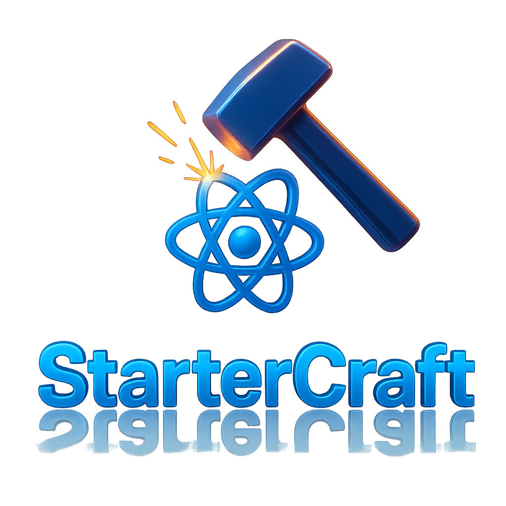

<div align="center">
  
</div>

# ⚡️ Fast and Scalable React Project

[](./LICENCE.md)
[](https://github.com/luciancaetano/startercraft/graphs/contributors)
[](https://github.com/luciancaetano/startercraft/commits/main)

An **opinionated boilerplate** designed to accelerate the development of modern, scalable React applications with TypeScript.
This template is especially suited for projects that require high scalability and complexity, promoting a clean architecture, modularity, and conventions that make maintenance easier, improve code quality, and enhance overall codebase understanding across the team.

## 🚀 Create a New Project

To quickly start a new project using this template, run the following command:

```bash
npx create-startercraft my-awesome-scalable-project
```

Replace `my-awesome-scalable-project` with your desired project name. This command will set up a new project with all the configurations and best practices included in this template.

---

## 📖 Index

- [📂 Component Organization](./docs/component-organization.md)
- [🏛️ Domain Layer](./docs/domain-layer.md)
- [⚙️ Code Generation](./docs/code-generation.md)
- [🧩 What is a Feature?](./docs/feature-definition.md)
- [⚖️ License](./LICENCE.md)
- [🚀 Features](#-features)
- [📋 Prerequisites](#-prerequisites)
- [📦 Installation](#-installation)
- [🛠️ Scripts](#%EF%B8%8F-scripts)
- [🧭 Path Aliases](#-path-aliases)
- [⚙️ Code Generation](#%EF%B8%8F-code-generation)
- [🧩 Why This Structure?](#-why-this-structure)
- [📚 Examples of Use](#-examples-of-use)
- [🧪 Testing Guide](./docs/testing-guide.md)
- [🔄 GitHub Workflows](./docs/workflows-deps.md)
- [❓ FAQ](#-faq)
- [🤝 Contributing](#-contributing)
- [📜 License](#-license)
- [🌟 Acknowledgements](#-acknowledgements)
- [🔗 Useful Links](#-useful-links)

---

## 🚀 Features

[🔝 Back to Index](#-index)

This starter ships with everything you need to build production-grade React apps:

- **Core**
  - [React](https://reactjs.org/) – UI library
  - [TypeScript](https://www.typescriptlang.org/) – static typing
  - [React Router](https://reactrouter.com/) – routing
  - [web-vitals](https://web.dev/vitals/) – performance monitoring

- **Styling & UI**
  - [Tailwind CSS](https://tailwindcss.com/) – utility-first styling

- **Testing & Quality**
  - [Vitest](https://vitest.dev/) – unit testing
  - [React Testing Library](https://testing-library.com/docs/react-testing-library/intro/) – testing React components
  - [ESLint](https://eslint.org/) – linting

- **Developer Experience**
  - Code generation (components & features)
  - Path aliases for cleaner imports
  - Pre-configured validation pipeline (`type-check + lint + test`)

---

## 📋 Prerequisites

[🔝 Back to Index](#-index)

Before you begin, ensure you have the following installed:

- [Node.js](https://nodejs.org/) (version 18 or higher)
- [npm](https://www.npmjs.com/)

---

## 📦 Installation

[🔝 Back to Index](#-index)

```bash
git clone https://github.com/luciancaetano/startercraft.git
cd startercraft
npm install
```

---

## 🛠️ Scripts

[🔝 Back to Index](#-index)

Commonly used commands from `package.json`:

| Command            | Description                                    |
| ------------------ | ---------------------------------------------- |
| `npm start`        | Start the development server                   |
| `npm run build`    | Compile the application for production         |
| `npm run preview`  | Preview the production build                   |
| `npm run test`     | Run all tests with coverage                    |
| `npm run lint`     | Run ESLint                                     |
| `npm run generate` | Run the code generator for components/features |
| `npm run validate` | Type-check, lint, and run tests                |

---

## 🧭 Path Aliases

[🔝 Back to Index](#-index)

To avoid messy relative imports, this starter uses TypeScript path aliases:

| Alias           | Path                     | Description                          |
| --------------- | ------------------------ | ------------------------------------ |
| `@features/*`   | `./src/app/features/*`   | Feature modules                      |
| `@components/*` | `./src/app/components/*` | Reusable UI components               |
| `@config/*`     | `./src/app/config/*`     | Configurations                       |
| `@domain/*`     | `./src/app/domain/*`     | Domain models, types & services      |
| `@hooks/*`      | `./src/app/hooks/*`      | Custom React hooks                   |
| `@utils/*`      | `./src/app/utils/*`      | Utility functions                    |
| `@assets/*`     | `./src/assets/*`         | Static assets (images, icons, fonts) |

---

## ⚙️ Code Generation

[🔝 Back to Index](#-index)

Easily scaffold new components or features with:

```bash
npm run generate
```

### 📂 Component Structure

```bash
src/app/components/[type]/[name]/
│── [name].tsx            # Component view
│── [name].spec.tsx       # Unit test
│── [name].module.scss    # Styles (scoped)
│── [name].types.ts       # Types & interfaces
│── [name].view-model.ts  # View-model / logic
│── index.ts              # Public exports
```

- **\[type]** → `elements`, `providers`, `pages`, or `layouts`
- **\[name]** → The component name

### 📂 Feature Structure

```bash
src/app/features/[name]/
│── [name].routes.tsx     # Feature route definitions
```

> Features are lightweight by default. Add `components/`, `hooks/`, `types/`, `utils/`, and `config/` subdirectories as needed.

### 📂 Scoped Component Structure

For components that are exclusively scoped to a parent component, nest them inside a `components/` folder:

```bash
src/app/components/[type]/[parent-name]/components/[child-name]/
│── [name].tsx            # Scoped child component view
│── [name].spec.tsx       # Unit test
│── [name].module.scss    # Styles (scoped)
│── [name].types.ts       # Types & interfaces
│── [name].view-model.ts  # View-model / logic
│── index.ts              # Public exports
```

---

## 🧩 Why This Structure?

[🔝 Back to Index](#-index)

- ✅ **Modularity** – clean separation of concerns
- ✅ **Scalability** – easy to extend features
- ✅ **Reusability** – atomic components & shared utils
- ✅ **Maintainability** – consistent architecture & conventions
- ✅ **DX Friendly** – generation tools, linting & validation pipeline

---

## 📚 Examples of Use

[🔝 Back to Index](#-index)

### Running the Development Server

```bash
npm start
```

### Running Tests

```bash
npm test
```

### Building for Production

```bash
npm run build
```

---

## ❓ FAQ

[🔝 Back to Index](#-index)

### What is the minimum Node.js version required?

Node.js version 18 or higher is required. Using the latest LTS version is recommended for better stability and support.

### How do I add a new feature or component?

Use the code generation tool by running:

```bash
npm run generate
```

Follow the prompts to scaffold the desired feature or component.

### How do I configure environment variables?

Create a `.env` file in the root directory and define your variables there. Use the `example.env` file as a reference.

### How do I update dependencies?

Run the following command to update all dependencies:

```bash
npm update
```

For major version updates, review the changelogs of the respective packages to ensure compatibility.

### How do I report a bug or request a feature?

Open an issue on the [GitHub repository](https://github.com/luciancaetano/startercraft/issues) with detailed information about the bug or feature request.

---

## 🤝 Contributing

[🔝 Back to Index](#-index)

1. Fork the repository
2. Create a new branch (`git checkout -b feature/amazing-feature`)
3. Commit your changes (`git commit -m "feat: add amazing feature"`)
4. Push to the branch (`git push origin feature/amazing-feature`)
5. Open a Pull Request

---

## 📜 License

[🔝 Back to Index](#-index)

This project is licensed under the [CC0](./LICENCE.md).

---

## 🌟 Acknowledgements

[🔝 Back to Index](#-index)

This starter was inspired by best practices and setups from the React community, with the goal of helping teams build robust and maintainable apps faster.

---

## 🔗 Useful Links

[🔝 Back to Index](#-index)

- [React Documentation](https://reactjs.org/docs/getting-started.html)
- [TypeScript Documentation](https://www.typescriptlang.org/docs/)
- [React Router Documentation](https://reactrouter.com/)
- [Tailwind CSS Documentation](https://tailwindcss.com/docs)
- [Vitest Documentation](https://vitest.dev/guide/)
- [Web Vitals](https://web.dev/vitals/)
