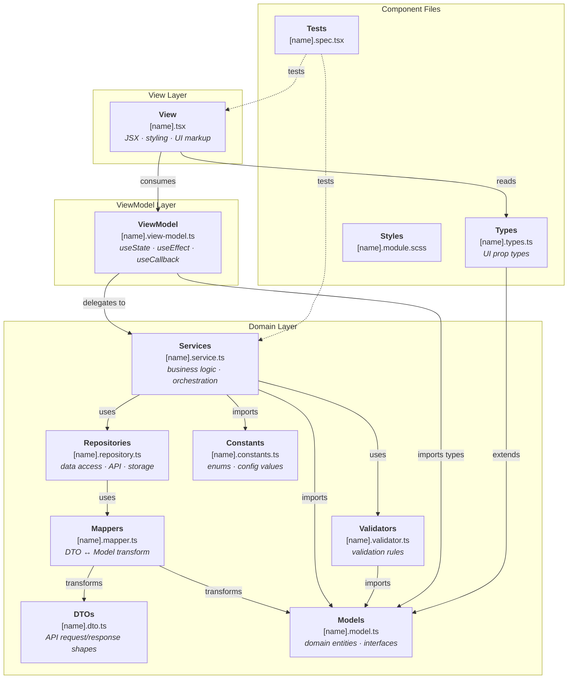
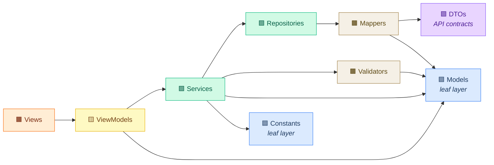
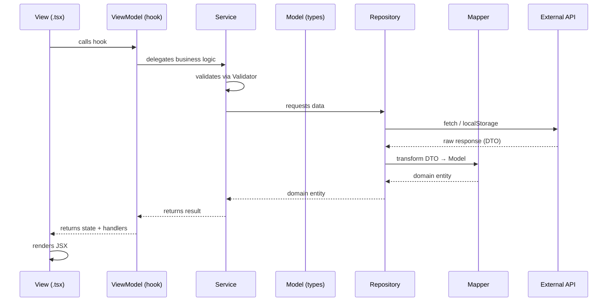

# Domain Layer Architecture

This document describes the domain layer introduced to enforce clean separation of concerns between business logic and React presentation code.

---

## Architecture Overview



### Dependency Flow



### Data & Control Flow (runtime)



---

## Problem Statement

Previously, all business logic lived inside React hooks (view-model files). This created several issues:

- **Untestable logic** - Business rules could not be tested without rendering React components or mocking React internals.
- **Coupled persistence** - Direct calls to `localStorage`, `document.body`, and `window.matchMedia` were embedded in view-models.
- **No reusability** - Logic trapped in hooks could not be shared across non-React contexts (CLI tools, server-side rendering, other frameworks).
- **Blurred boundaries** - The "Model" layer in the MVVM pattern only contained UI prop types, not actual domain entities.

---

## Domain Layer Structure

```
src/app/domain/
  index.ts                  # Re-exports everything
  models/
    index.ts                # Barrel export for all models
    [name].model.ts         # Domain entities, value types, and shared interfaces
  services/
    index.ts                # Barrel export for all services
    [name].service.ts       # Business logic and orchestration
  repositories/
    index.ts                # Barrel export for all repositories
    [name].repository.ts    # Data access (API calls, localStorage, IndexedDB)
  validators/
    index.ts                # Barrel export for all validators
    [name].validator.ts     # Validation rules and schemas
  mappers/
    index.ts                # Barrel export for all mappers
    [name].mapper.ts        # DTO ↔ Model transformations
  dtos/
    index.ts                # Barrel export for all DTOs
    [name].dto.ts           # API request/response type contracts
  constants/
    index.ts                # Barrel export for all constants
    [name].constants.ts     # Domain enums, config values, magic strings
```

All application-level TypeScript types (previously in `src/app/types/`) now live in `domain/models/`. All HTTP/API logic (previously in `src/app/http/`) now lives in `domain/repositories/` and `domain/services/`.

### Models (`domain/models/`)

Models define the core data types, domain entities, and shared interfaces. They are:

- **Framework-agnostic** - No React, no hooks, no JSX
- **Pure TypeScript** - Only types, interfaces, and enums
- **The source of truth** - All layers reference these types
- **Includes shared contracts** - Cross-cutting interfaces like `ITestableProps` live here

Example:
```ts
// color-mode.model.ts
export type ColorMode = 'dark' | 'light';

export interface ColorModePreference {
  mode: ColorMode;
  source: 'system' | 'user';
}
```

### Services (`domain/services/`)

Services orchestrate business rules and coordinate between repositories, validators, and mappers. They are:

- **Stateless functions** - Exported as object namespaces for discoverability
- **Testable without React** - Plain functions that can be unit tested directly
- **The single owner of business logic** - All business decisions and orchestration live here
- **Do NOT access external systems directly** - Delegate data access to repositories

Example:
```ts
// color-mode.service.ts
import type { ColorMode, ColorModePreference } from '../models';
import { ColorModeRepository } from '../repositories';

export const ColorModeService = {
  resolvePreference(): ColorModePreference {
    const saved = ColorModeRepository.load();
    if (saved) return { mode: saved, source: 'user' };
    return { mode: ColorModeRepository.getSystemPreference(), source: 'system' };
  },
  toggle(current: ColorMode): ColorMode {
    return current === 'dark' ? 'light' : 'dark';
  },
  savePreference(mode: ColorMode): void {
    ColorModeRepository.save(mode);
  },
  applyToDocument(mode: ColorMode): void {
    ColorModeRepository.applyToDocument(mode);
  },
};
```

### Repositories (`domain/repositories/`)

Repositories abstract data access — API calls, localStorage, IndexedDB, cookies, etc. They are:

- **The only layer that talks to external systems** - fetch, axios, localStorage, etc.
- **Return domain models** - Use mappers to convert DTOs before returning
- **Easily mockable** - Tests can swap the repository without touching business logic

Example:
```ts
// color-mode.repository.ts
import type { ColorMode } from '../models';

export const ColorModeRepository = {
  load(): ColorMode | null {
    return localStorage.getItem('color-mode') as ColorMode | null;
  },
  save(mode: ColorMode): void {
    localStorage.setItem('color-mode', mode);
  },
  getSystemPreference(): ColorMode {
    if (typeof window !== 'undefined' && window.matchMedia) {
      return window.matchMedia('(prefers-color-scheme: dark)').matches ? 'dark' : 'light';
    }
    return 'light';
  },
  applyToDocument(mode: ColorMode): void {
    if (mode === 'dark') {
      document.body.classList.add('dark');
    } else {
      document.body.classList.remove('dark');
    }
    document.body.setAttribute('data-theme', mode);
  },
};
```

### Validators (`domain/validators/`)

Validators contain pure validation logic for domain entities. They are:

- **Pure functions** - No side effects, return validation results
- **Reusable** - Can be used by services, forms, or API handlers
- **Decoupled from UI** - No React, no form libraries

Example:
```ts
// user.validator.ts
import type { User } from '../models';

export const UserValidator = {
  isValidEmail(email: string): boolean {
    return /^[^\s@]+@[^\s@]+\.[^\s@]+$/.test(email);
  },
  validateProfile(user: Partial<User>): string[] {
    const errors: string[] = [];
    if (!user.name) errors.push('Name is required');
    if (user.email && !UserValidator.isValidEmail(user.email)) errors.push('Invalid email');
    return errors;
  },
};
```

### Mappers (`domain/mappers/`)

Mappers transform data between DTOs (API shapes) and domain models. They are:

- **Pure transformations** - Input in, output out, no side effects
- **Bidirectional** - `toModel()` for API → app, `toDto()` for app → API
- **Single responsibility** - One mapper per entity

Example:
```ts
// user.mapper.ts
import type { User } from '../models';
import type { UserDto } from '../dtos';

export const UserMapper = {
  toModel(dto: UserDto): User {
    return { id: dto.id, name: dto.full_name, email: dto.email_address };
  },
  toDto(model: User): UserDto {
    return { id: model.id, full_name: model.name, email_address: model.email };
  },
};
```

### DTOs (`domain/dtos/`)

DTOs (Data Transfer Objects) define the exact shape of external API requests and responses. They are:

- **Mirror the API contract** - Field names match the API, not the app
- **Never used in UI code** - Always mapped to domain models first
- **Versioned with the API** - If the API changes, only the DTO and mapper change

Example:
```ts
// user.dto.ts
export interface UserDto {
  id: number;
  full_name: string;
  email_address: string;
  created_at: string; // ISO 8601 from API
}

export interface CreateUserRequestDto {
  full_name: string;
  email_address: string;
}
```

### Constants (`domain/constants/`)

Constants hold domain-specific enums, configuration values, and magic strings. They are:

- **Single source of truth** - No magic strings scattered across the codebase
- **Importable by any layer** - Models, services, repositories, and UI can all reference them

Example:
```ts
// storage-keys.constants.ts
export const StorageKeys = {
  COLOR_MODE: 'color-mode',
  AUTH_TOKEN: 'auth-token',
  LANGUAGE: 'i18n-language',
} as const;

// routes.constants.ts
export const Routes = {
  HOME: '/',
  LOGIN: '/login',
  NOT_FOUND: '/404',
} as const;
```

---

## How View-Models Consume Services

View-models (hooks) become thin orchestration layers:

**Before (business logic in hook):**
```ts
function useDarkModeSwitchViewModel() {
  const [colorMode, setColorMode] = useState(getPreferredColorScheme());
  // ... localStorage reads, DOM manipulation, toggle logic inline
}
```

**After (hook delegates to service):**
```ts
import { ColorModeService } from '@domain/services';

function useDarkModeSwitchViewModel() {
  const [colorMode, setColorMode] = useState(
    () => ColorModeService.resolvePreference().mode
  );

  const switchColorMode = useCallback(() => {
    setColorMode((current) => {
      const next = ColorModeService.toggle(current);
      ColorModeService.savePreference(next);
      return next;
    });
  }, []);

  useEffect(() => {
    ColorModeService.applyToDocument(colorMode);
  }, [colorMode]);

  return { colorMode, switchColorMode };
}
```

The hook now only manages React state and lifecycle. All business decisions are delegated to the service.

---

## Responsibility Boundaries

| Layer | Responsibility | May Import |
|-------|---------------|------------|
| **Models** | Domain types, interfaces, enums | Nothing (leaf layer) |
| **Constants** | Domain enums, config values | Nothing (leaf layer) |
| **DTOs** | API request/response contracts | Nothing (leaf layer) |
| **Validators** | Validation rules | Models, Constants |
| **Mappers** | DTO ↔ Model transformations | Models, DTOs |
| **Repositories** | Data access (API, storage) | Models, DTOs, Mappers, Constants |
| **Services** | Business logic, orchestration | Models, Repositories, Validators, Constants |
| **View-Models** | React state orchestration | Models, Services, Constants |
| **Views** | JSX rendering, styling | View-Models, component types |

---

## Path Alias

The domain layer is accessible via the `@domain/*` alias:

```ts
import { ColorModeService } from '@domain/services';
import type { ColorMode } from '@domain/models';
```

---

## Guidelines for Adding New Domain Features

### 1. Define the model first

Create `src/app/domain/models/[name].model.ts` with your domain types. Export them from `models/index.ts`.

### 2. Create the service

Create `src/app/domain/services/[name].service.ts`. Implement business rules as pure functions. Export as a namespace object from `services/index.ts`.

### 3. Refactor the view-model

Replace inline logic in your view-model hook with calls to the new service. The hook should only:
- Call `useState` / `useReducer` for React state
- Call `useEffect` for side-effect scheduling
- Call `useCallback` / `useMemo` for performance
- Delegate all decisions to the service

### 4. Update barrel exports

Add new exports to `domain/models/index.ts`, `domain/services/index.ts`, and `domain/index.ts`.

---

## Migration Strategy

For existing hooks that contain business logic:

1. **Identify extractable logic** - Look for: data transformations, validation rules, API calls, localStorage access, DOM manipulation, conditional business decisions.
2. **Create the model** - Extract domain types from `[name].types.ts` into `domain/models/`. Keep UI prop types in the component's `types.ts`.
3. **Create the service** - Move business functions into `domain/services/[name].service.ts`.
4. **Update the view-model** - Import the service and replace inline logic with service calls.
5. **Verify** - Run existing tests. The component's behavior should be identical.

Migrate incrementally, one component at a time. There is no need for a big-bang rewrite.
